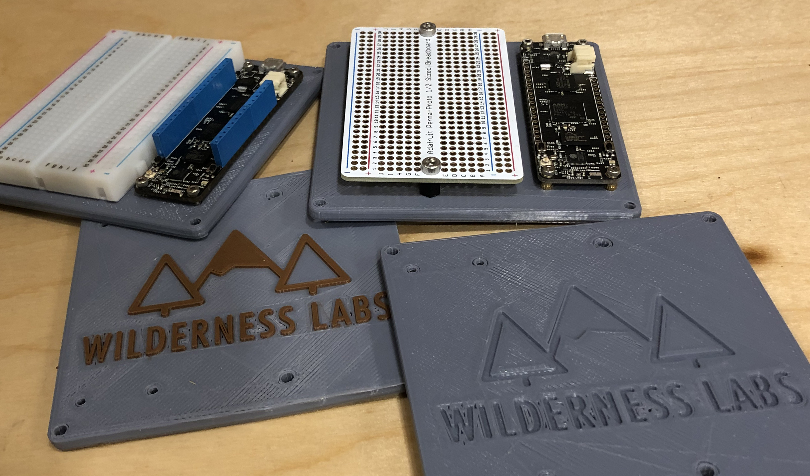
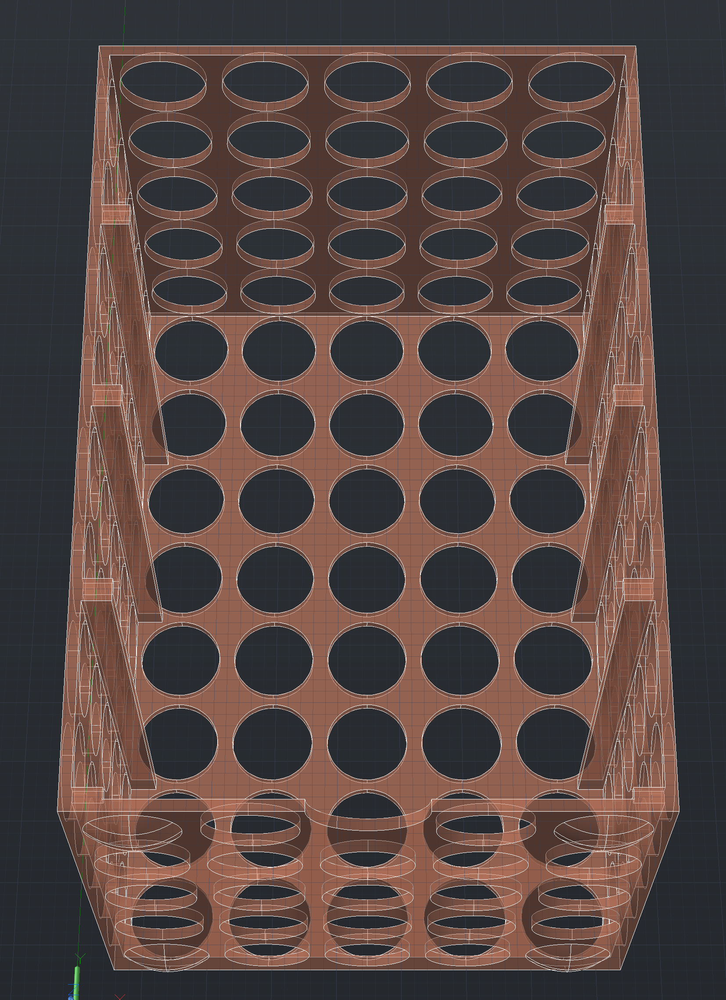

# Baseboards + Shelves

Here you'll find prototype baseboards for Meadow and Netduino. These baseboards are designed specifically to hold a Meadow or Netduino and a standard [Half+ size breadboard](http://amzn.to/2fMEgGH):

Additionally, there is a Meadow baseboard shelf to help w/circuit organization:

Included in here are both the source files (as AutoCad `.dwg` files) and the print-ready `.stl` files.

For those with dual extruders, we've included both the base and the logo as separate files for dual extrusion merging.  

# Meadow Baseboards and Shelf

Use the `Baseboard_Meadow.stl` file to print:

The logo for dual extrusion is in `Baseboard_Meadow_Logo.stl`.

The shelf can be found as `Baseboard_Circuit-Shelf.stl`, and has nubs on the bottom to allow stacking:

# Netduino Baseboards

These baseboards are designed to hold a Netduino and a [half-size breadboard](http://amzn.to/2fMEgGH) for an easy prototyping base. After printing, you may want to ream the holes with a standard [3.2mm (1/8") drill bit](http://amzn.to/2xBmAXN). The Netduino can be mounted with [12mm M3 socket screws](http://amzn.to/2xvG6Dw) and [M3 nuts](http://amzn.to/2y4LosQ), or [double-sided mounting tape](http://amzn.to/2xAPszi). We use [8mm M3 hex spacers](http://amzn.to/2xMv7Hj) for the legs.

 
## [Standard Half-size Breadboard Base](Standard_Halfsize_Breadboard)

## [Appliance Control Board](Appliance_Control_Baseboard)

This board is designed to hold a [2 channel](http://amzn.to/2xBiHSM) or [4 channel](http://amzn.to/2y4CDir) Keyestudio relay as well as [screw terminal blocks](http://amzn.to/2y3Vqdx).