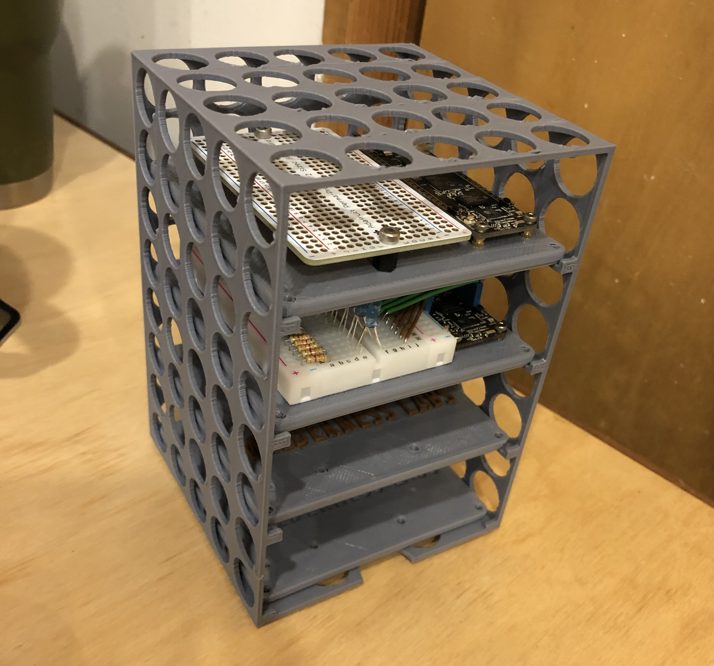
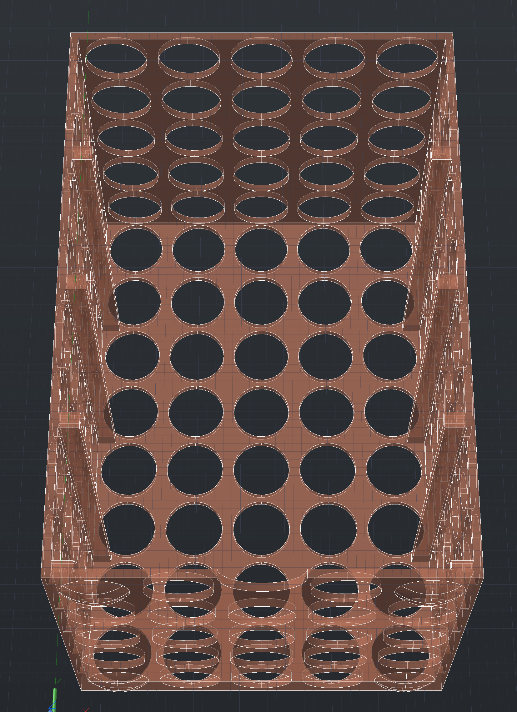

# Circuit Shelves

Additionally, there is a Meadow baseboard shelf to help w/circuit organization:

Included in here are both the source files (as AutoCad `.dwg` files) and the print-ready `.stl` files.

The shelf can be found as `Baseboard_Circuit-Shelf.stl`

## Stackable

The shelves have feet nubs that align with the holes on top to allow them to stack:

## Can be Resized to Fit other Baseboards

If you want shelves to fit another size of baseboard, you can simply resize the x & y scale of the shelf when printing.
