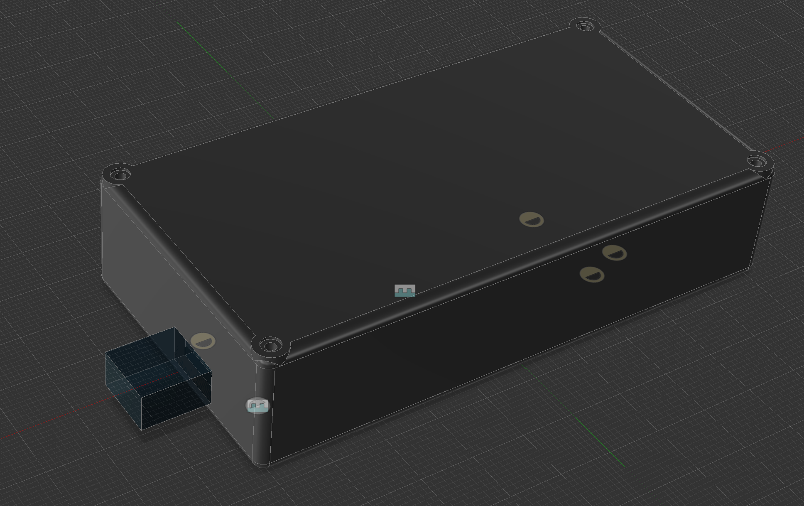

# Meadow F7 Parametric Enclosure

A 3D printable, easily modifiable Meadow F7 enclosure. To modify, first modify the existing parameters, and then add your desired features.

## Parameters

This enclosure is easily modifable with the following parameters/variables (all sizes in `mm`):

* **InternalWidth** - The size of the internal cavity in the `X` axis.
* **InternalDepth** - The size of the internal cavity in the `Y` axis.
* **InternalHeight** - The size of the internal cavity in the `Z` axis.
* **WallThickness** - The thickness of the walls of the enclosure. 
* **ExternalChamfer** - The radius of the external filet that surrounds the box. Must be `<= WallThickness`.
* **Meadow_X** - The distance from the bottom left internal corner of the bolt hole of the Meadow along the `X` axis. Must be `> 3mm`.
* **Meadow_Y** - The distance from the bottom left internal corner of the bolt hole of the Meadow along the `Y` axis. Must be `>3mm`.

To edit parameters, open the model in Fusion 360 and choose **Modify > Change Parameters**:

## Model

