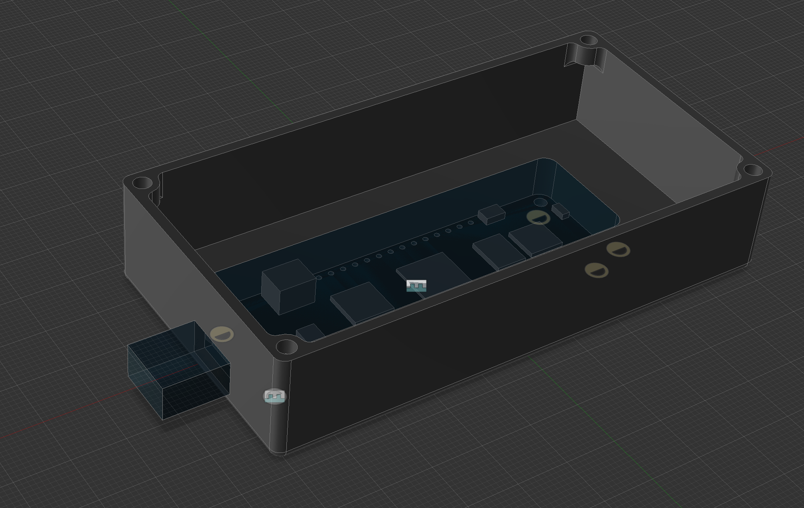
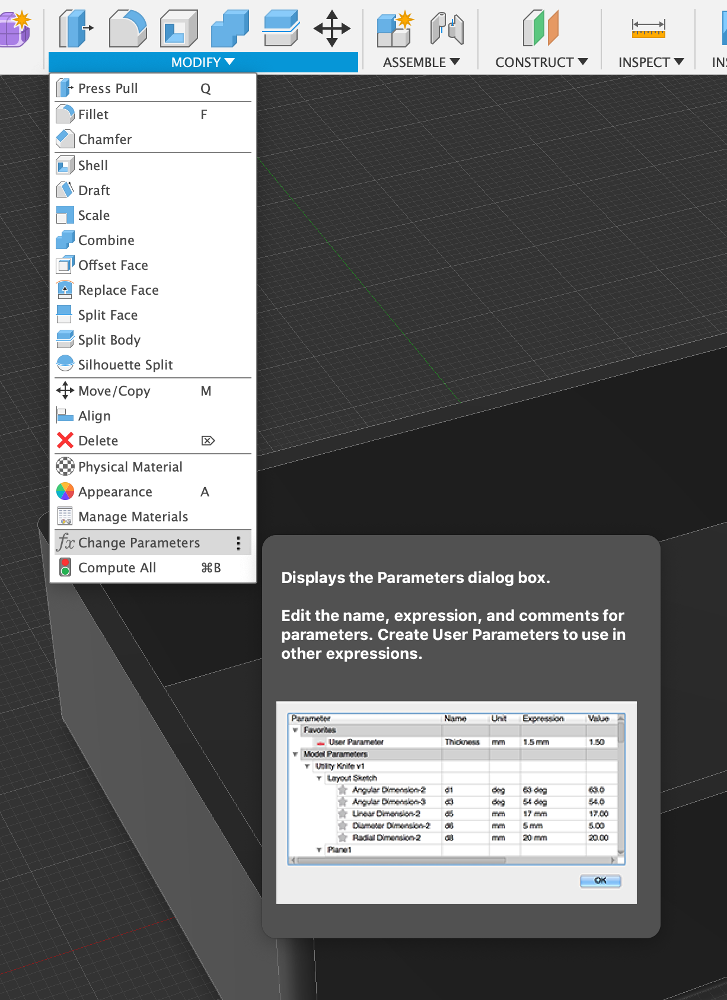
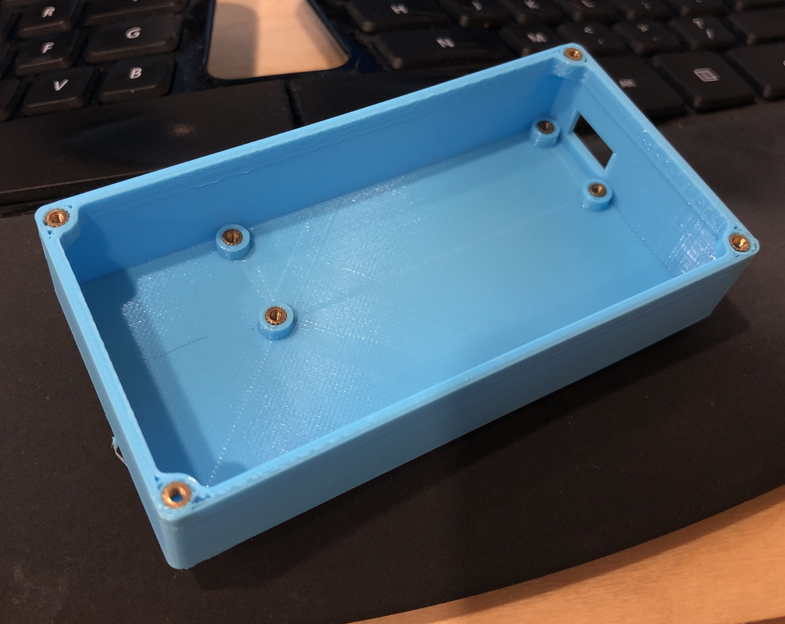
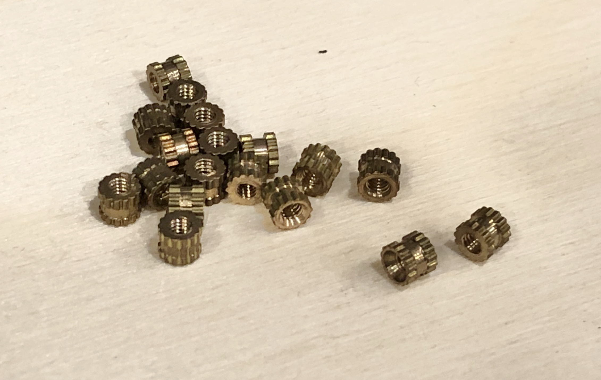

# Meadow F7 Parametric Enclosure

A 3D printable, easily modifiable Meadow F7 enclosure. To modify, first modify the existing parameters, and then add your desired features.

## Parameters

This enclosure is easily modifable with the following parameters/variables (all sizes in `mm`):

* **InternalWidth** - The size of the internal cavity in the `X` axis.
* **InternalDepth** - The size of the internal cavity in the `Y` axis.
* **InternalHeight** - The size of the internal cavity in the `Z` axis.
* **WallThickness** - The thickness of the walls of the enclosure. 
* **ExternalChamfer** - The radius of the external filet that surrounds the box. Must be `<= WallThickness`.
* **Meadow_X** - The distance from the bottom left internal corner of the bolt hole of the Meadow along the `X` axis. Must be `> 3mm`.
* **Meadow_Y** - The distance from the bottom left internal corner of the bolt hole of the Meadow along the `Y` axis. Must be `>3mm`.

To edit parameters, open the model in Fusion 360 and choose **Modify > Change Parameters**:

## Enclosure Assembly

The enclosure is intended to be used with M2 heat-set inserts and M2x4mm socket head screws:

To assemble the enclosure, you'll need:

 * **(8) M2x4mm Socket Head Screws** - These are fairly common screws, and can be had from [Amazon](https://www.amazon.com/s?k=m2x4mm+socket+head+screws&ref=nb_sb_noss), or in bulk from [AliExpress](https://www.aliexpress.com/item/32945000745.html?spm=2114.12010612.8148356.1.6ce27cadoinlmg).
 * **(8) M2 non-tapered heat set inserts** - The holes in the model are already tapered, so you can use the cheap (non-tapered) knurled M2 inserts. You can find them on [Amazon](https://www.amazon.com/s?k=m2+inserts&ref=nb_sb_noss_1) or in bulk at [AliExpress](https://www.aliexpress.com/wholesale?catId=0&initiative_id=SB_20200629100233&origin=y&SearchText=m2+knurled+inserts):
   
   
### Heat-set Insert Installation

Hackaday has a [fantastic article on using heat-set inserts](https://hackaday.com/2019/02/28/threading-3d-printed-parts-how-to-use-heat-set-inserts/). If you plan on using a heat-set insert soldering iron attachment, I haven't been able to find any that work with M2 (M3 is the smallest size I've seen), but you can file down an M3 tip to fit M2 inserts pretty easily. I've also had good luck using a regular flat soldering iron tip.

