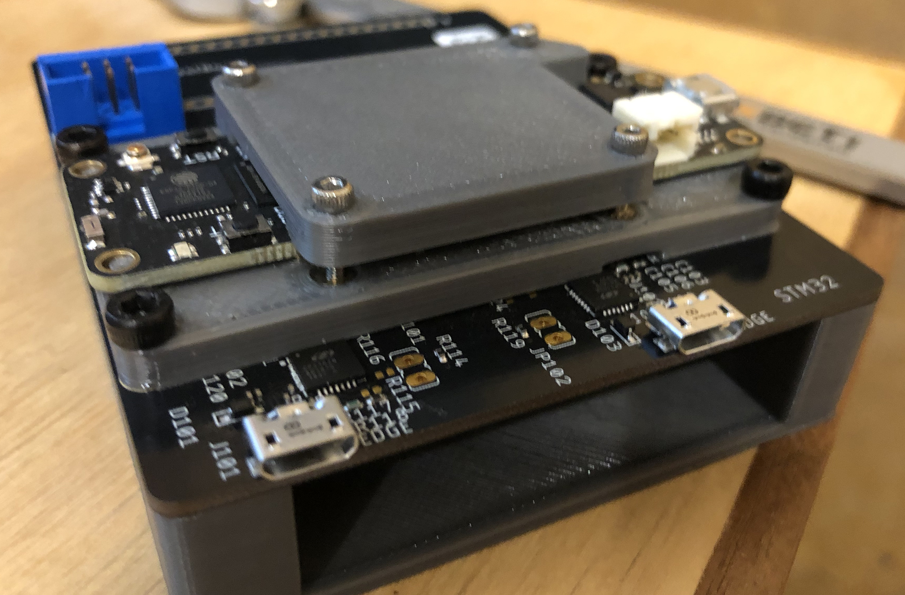
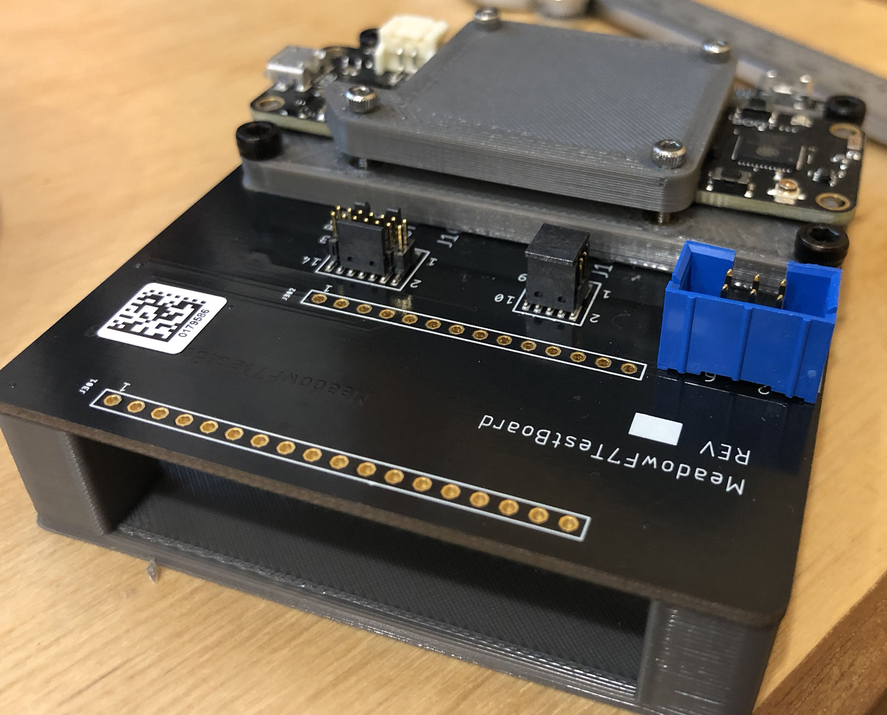

# Meadow F7 Micro Dev PogoBed Assembly

| | |
|--------------------------|--------------------------|
|  |  |

This pogo bed assembly is designed with the F7 Micro Dev board and exposes the JTAG for both the STM32F7 and ESP32, as well as other sundry breakouts. It also breaks out all the header pins to an external header set.

The source (a Fusion 360 file) as well as STLs for printing are included here.

It's recommended that you print in PETG for strength, and you'll need the following hardware:

| Item  | QTY | Description |
|-------|-----|-------------|
| M3x12 | 4   | Used to mount the assembly to the breakout board. |
| M2x11 | 4   | Used to mount the hold down. |
| M2 inserts | 4 | Used to provide a backing to the M2 bolts.
