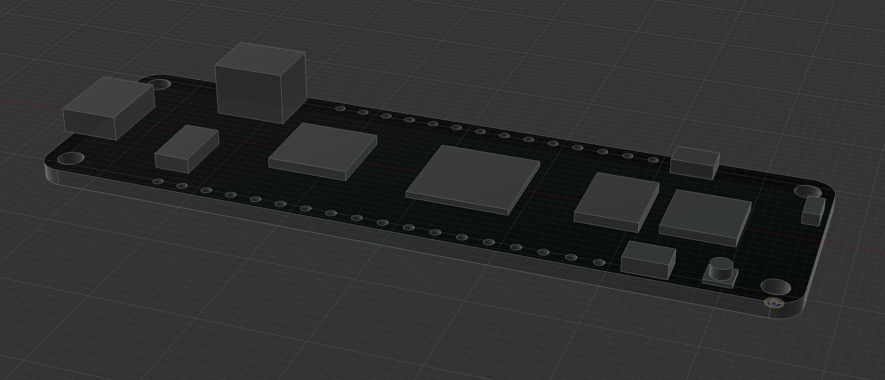
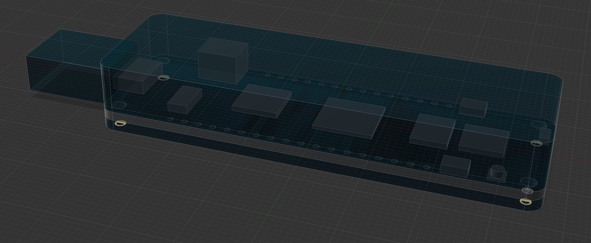

# Meadow Reference Models

The `Meadow_F7_Micro.f3d` file is a Fusion 360 model of the F7 development board:

Clearance areas for the USB connector, and optional female headers is also available as a "Clearance" component in the object:

