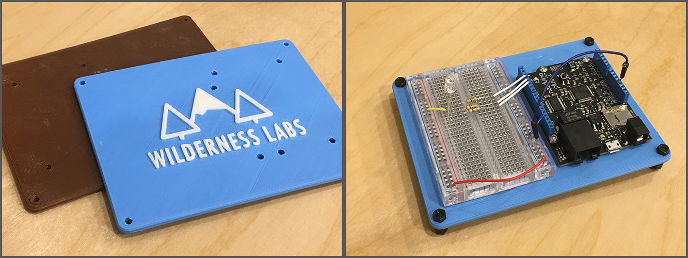

# Netduino Baseboards

These baseboards are designed to hold a Netduino and a [half-size breadboard](http://amzn.to/2fMEgGH) for an easy prototyping base. After printing, you may want to ream the holes with a standard [3.2mm (1/8") drill bit](http://amzn.to/2xBmAXN). The Netduino can be mounted with [12mm M3 socket screws](http://amzn.to/2xvG6Dw) and [M3 nuts](http://amzn.to/2y4LosQ), or [double-sided mounting tape](http://amzn.to/2xAPszi). We use [8mm M3 hex spacers](http://amzn.to/2xMv7Hj) for the legs.

