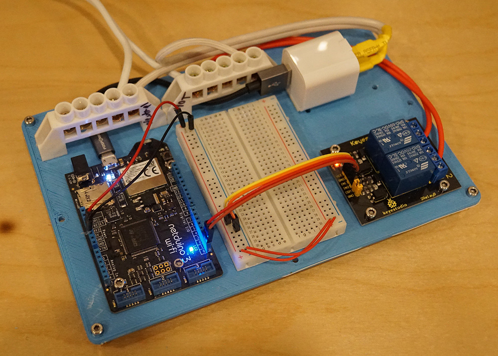
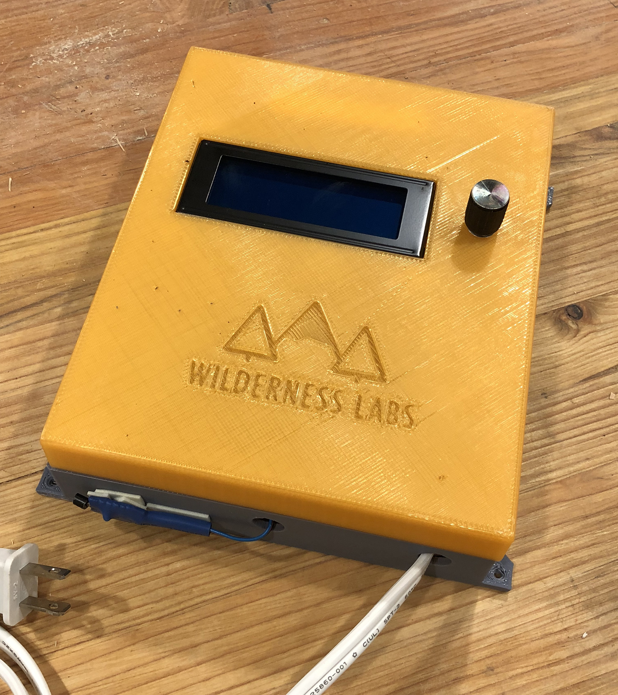

# Netduino Designs

## [Baseboard for Half-size Breadboard](Baseboard_for_Halfsize_Breadboard)

## [Appliance Control Board](Appliance_Control_Baseboard)

This board is designed to hold a [2 channel](http://amzn.to/2xBiHSM) or [4 channel](http://amzn.to/2y4CDir) Keyestudio relay as well as [screw terminal blocks](http://amzn.to/2y3Vqdx).

## [Appliance Hack Enclosure (Netduino-only)](Enclosures/ApplianceControl)

Hacking an appliance or other connected thing that needs a user interface and controls household mains electricity? This is the enclosure for you:

