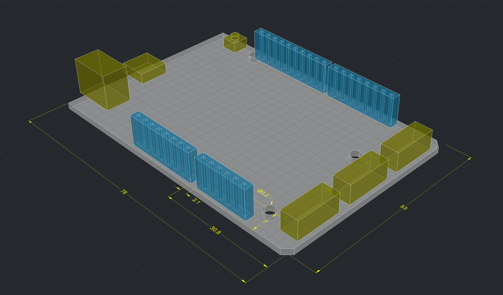
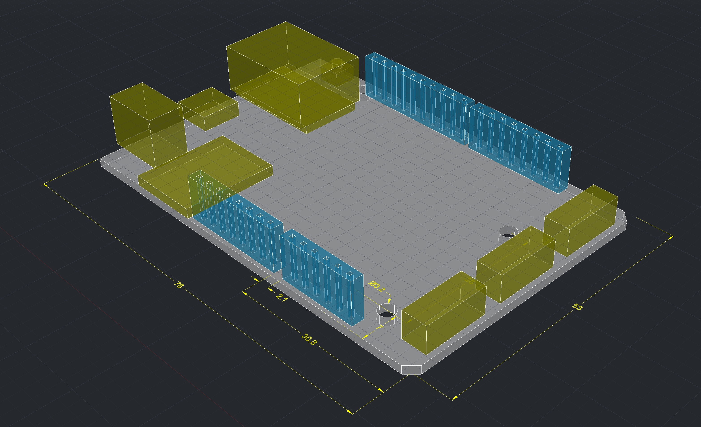
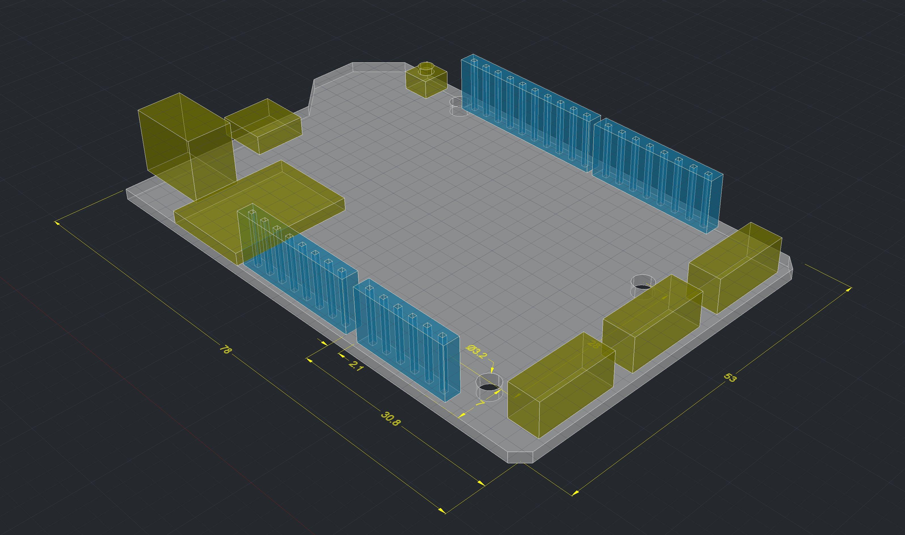

# Netduino 3 Reference Models

Reference models for the Netduino 3 line. Includes header, bolt holes, and peripheral dimensions. Useful for designing enclosures and integrations.

## Netduino 3 Base Model

## Netduino 3 Ethernet

## Netduino 3 WiFi

