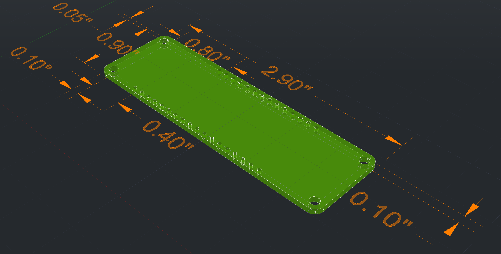
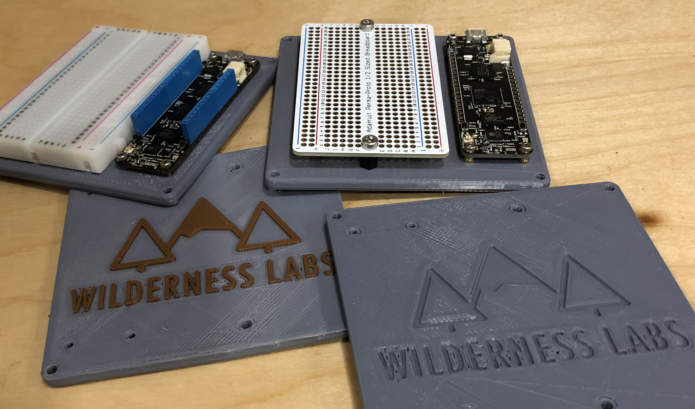
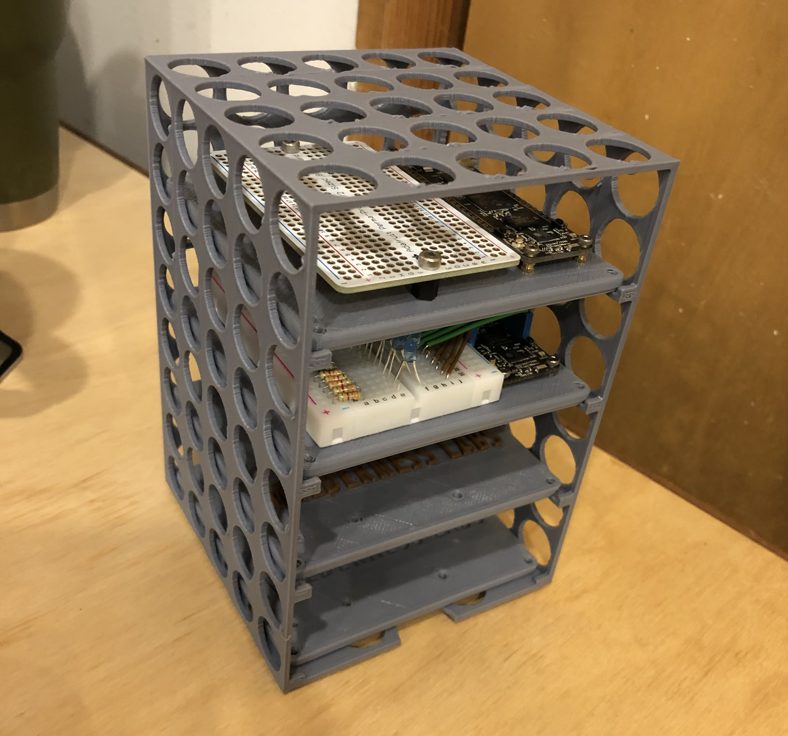
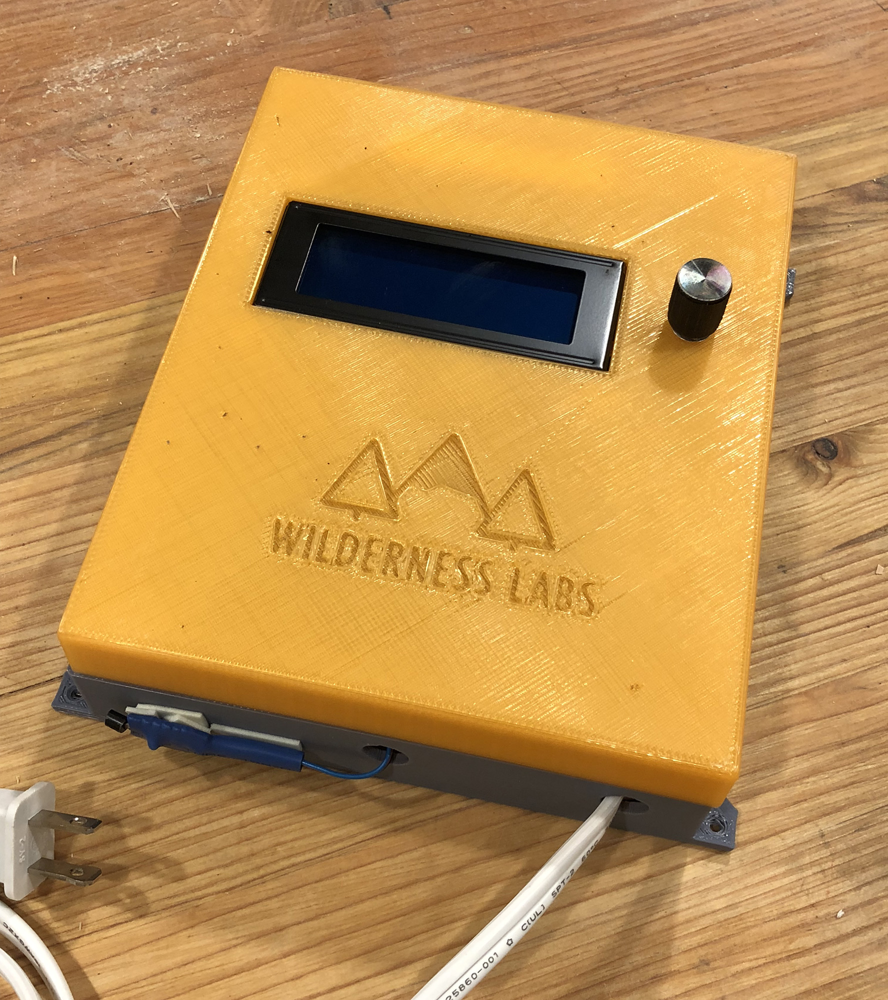

# 3D Print Designs

Repository of 3D printable designs such as baseboards, enclosures, etc., for Netduino.

## Meadow + Netduino Reference Models

Building an enclosure or integrating Netduino into project? These models can help by providing header, bolt hole, and peripheral dimensions.

## [Baseboards and Shelves](Baseboards/)

Check out our cool [baseboards](Baseboards/) for quick prototyping!

## [Appliance Hack Enclosure (Netduino-only)](Enclosures/ApplianceControl)

Hacking an appliance or other connected thing that needs a user interface and controls household mains electricity? This is the enclosure for you:

