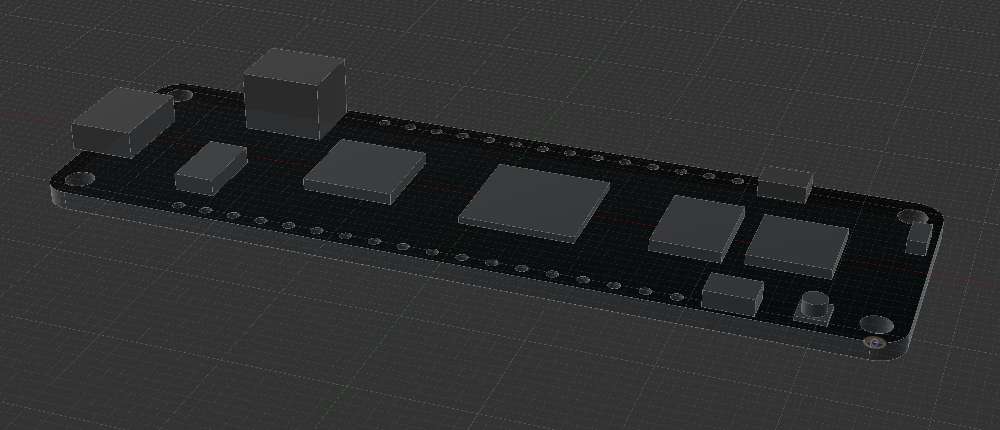
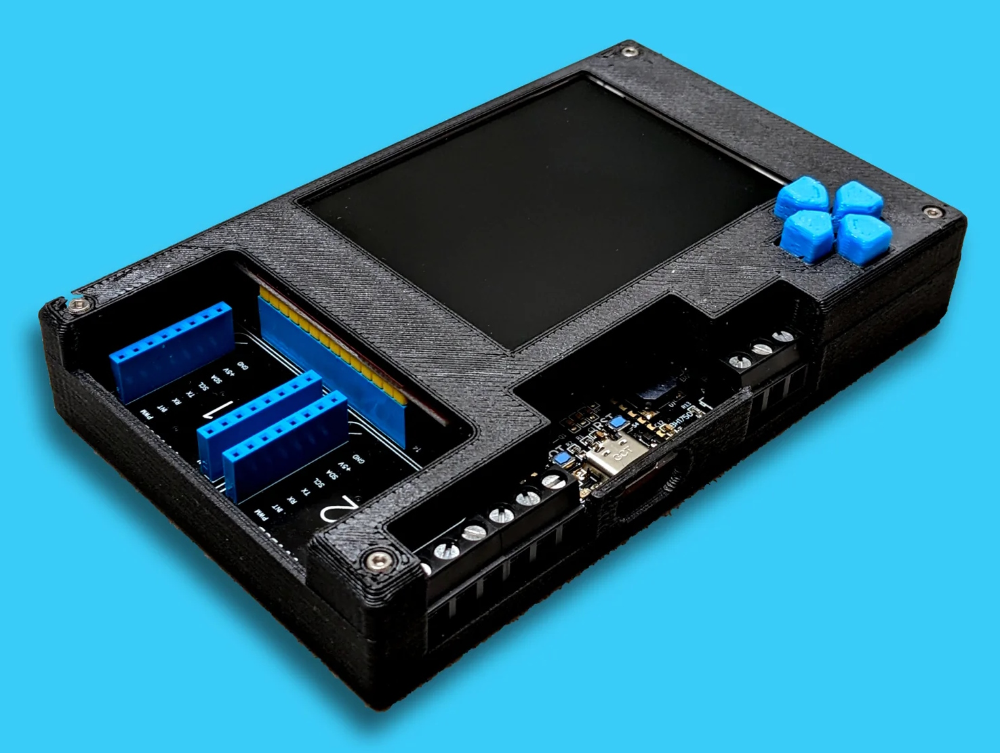

# 3D Print Designs

Repository of 3D printable designs such as baseboards, enclosures, etc., for Netduino.

## [Meadow Reference Models](Meadow/Reference_Models)

Building an enclosure or integrating Meadow into project? These models can help by providing header, bolt hole, and peripheral dimensions.

## [Meadow Parametric Enclosure](Meadow/Enclosures/Meadow_F7_Parametric_Enclosure)

A 3D printable, easily modifiable Meadow F7 enclosure that can be used as a base for additional features:

## [Project Lab Enclosure](https://github.com/WildernessLabs/Meadow.ProjectLab/tree/main/Design/Enclosure/STLs_For_Printing)

A 3D printable [enclosure for the Project Lab IoT prototyping platform](https://github.com/WildernessLabs/Meadow.ProjectLab/tree/main/Design/Enclosure/STLs_For_Printing). The enclosure frames the LCD and allows access to the Project Lab board's ports and connectors. Openings are available for the USB-C port for power and code deployment. There are also openings to connect to the two mikroBUS sockets, three Grove connectors, the Qwiic connector, and all screw terminals (RS-485, I/O, and power).

## [Baseboards](Baseboards/)

Check out our cool [baseboards](Baseboards/) for quick prototyping!

## [Circuit Shelves](Circuit_Shelves)

## [Peripheral Models](Peripheral_Models)

Additionally, there are various peripheral models for use in designing enclosures and whatnot.

## Note on Source File Types

Newer file types are [Fusion 360](https://www.autodesk.com/products/fusion-360/overview) `.f3d` files. Fusion is free for non-commercial use and is both powerful and easy to use. 

Some older source file types are AutoCAD `.dwg` files. We've generally moved away from AutoCAD in favor of Fusion 360.
